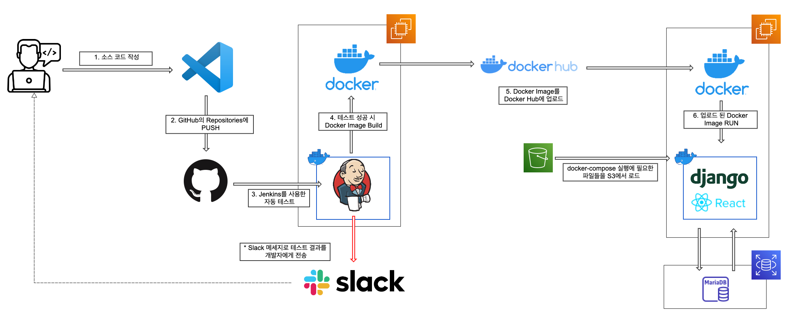

# ✏️ 캐치스터디

### 🤔 **내가 원하는 주제의 스터디는 없을까?**

나와 같은 목표를 가진 사람들과 함께 스터디를 시작해보세요.

원하는 주제를 선택하여 스터디를 생성하고, 모집할 수 있는 사이트입니다!

**사이트 링크** : [https://catchstudys.com/](https://catchstudys.com/)
- [프론트엔드(React) Github](https://github.com/studysiteproject/Frontend)
- [백엔드(Spring) Github](https://github.com/studysiteproject/SpringApi)


<br/>

### 🧑‍💻 팀원

---

- **김동연**
    - **Blog** : [https://www.dongyeon1201.kr](https://www.dongyeon1201.kr)
    - **Github** : [https://github.com/Dongyeon1201](https://github.com/Dongyeon1201)
- **이종찬**
    - **Github** : [https://github.com/Lipeya](https://github.com/Lipeya)
- **임채민**
    - **Github** : [https://github.com/lacram](https://github.com/lacram)

<br/>

**[ 백엔드(Spring) ]** : 이종찬, 임채민

**[ 백엔드(Django) ]** : 김동연

**[ 프론트(React) ]** : 김동연

**[ CI/CD 환경 구축(Jenkins) ]** : 김동연

**[ 기획, 디자인 ]** : 김동연, 이종찬, 임채민

<br/>

### 📝 프로젝트때 작성한 문서 & 진행도

---

- [프로젝트 노션 ](https://www.notion.so/91c98ac183cf43c1b6fe010fa40ff50d)
- [API Docs](https://www.notion.so/API-DOCS-e4d7c6948b99490e9af130151d62e750)

<br/>

### 🏗️ 기능

---

- **JWT를 이용**한 사용자 로그인, 로그아웃, 이메일 인증, 사용자 검증 구현

- 사용자의 닉네임, 이메일, 기술스택, URL 등이 작성된 프로필의 관리 기능 구현

- 사용자의 스터디 즐겨찾기, 댓글 관리 기능 구현

<br/>

### 🏗️ CI/CD 설계

---


<br/>

### 😎 Django 백엔드 서버를 만들며 경험한 것

---

- JWT를 사용한 사용자 인증

- DB와 연결하여 정보 관리

- 로컬과 배포 환경을 구분하여 설정 관리 (CORS 설정, DB 정보 등)

- JWT에 사용되는 키와 DB 정보 등 민감한 정보를 S3에 분리하여 관리

<br/>  

### 🛠️ Django를 용한 백엔드 구축 중 어려웠던 것

---

**JWT를 이용한 사용자 검증**이 개인적으로 가장 복잡했던 부분이었던것 같습니다.

아무래도 **사용자 관리를 중심으로 기능을 만든 백엔드**였기 때문에, 사용자 로그인, 로그아웃, 내 정보 확인 등 다양한 API에서 **사용자의 검증이 필요**했습니다.

이를 위해 **JWT를 이용한 사용자 검증을 사용**하기로 하였고, 이를 위해 여러 API에서도 편하게 사용자 검증을 추가하기 위한 설계가 필요했습니다.

이를 위해 `jwt_auth` 라는 **클래스를 별도로 생성**하여 **사용자 인증이 필요한 API에서 사용**하였습니다.

이때 안전한 토큰의 사용을 위해 `RS256` 방식을 사용하여 인코딩 하였습니다.

<br/>

JWT 토큰은 **사용자의 쿠키에 유저의 인덱스와 함께 설정됩니다.**

그리고 이 값들은 `jwt_auth` 클래스의 `verify_user` 함수에서 아래의 순서로 사용자 인증에 사용됩니다.

1. 쿠키에 설정된 Access Token의 Payload를 확인하여 유저 인덱스의 정보가 동일한지 확인**(변조 확인)**
    - 유효한 Token일 경우 : 쿠키에 설정된 Access Token을 검증합니다. (2번)
    - 변조된 Token일 경우 : 쿠키에 설정된 Access Token과 index를 삭제 후 **재 로그인을 요청**합니다.
    
2. 유효한 Access Token인지 확인합니다.
    - 유효한 Token일 경우 : **검증 성공으로 종료**합니다.
    - 유효한 Token이 아닐 경우 : Refresh Token을 검증합니다. (3번)
    
3. 쿠키에 설정된 해당 유저의 index를 이용하여 DB에서 Refresh Token을 확인합니다.
    - Refresh Token이 유효할 경우 : **새로운 Access Token을 발급** 후 **쿠키에 재 설정 후 종료** 합니다.
    
    - Refresh Token이 유효하지 않을 경우 : 쿠키에 설정된 Access Token과 index를 삭제 후 **재 로그인을 요청**합니다.
    
<br/>      

- `jwt_auth` 클래스를 이용한 사용자 인증 예시
  
    쿠키에 설정된 `access token`과 `사용자 인덱스`를 얻어와 **decode된 토큰의 payload와 일치하는지 확인**합니다.
    
    ```python
    # 사용될 클래스 호출
    auth = jwt_auth()
    
    def get(self, request):
    
        # access_token, user_index를 얻어온다.
        access_token = request.COOKIES.get('access_token')
        user_index = request.COOKIES.get('index')
    
        # 인증 성공 시, res(Response) 오브젝트의 쿠키에 토큰 & index 등록, status 200, 성공 msg 등록
        # 인증 실패 시, res(Response) 오브젝트의 쿠키에 토큰 & index 삭제, status 401, 실패 msg 등록
        res = self.auth.verify_user(access_token, user_index)
    
    		...
    ```
    
<br/>


### **🛠 보완해야 할 점**

---

### 1. 장고 서버의 설계

가장 아쉬운점은 API의 따른 장고 앱의 구분이 제대로 되어 있지 않다는 점이었습니다.

아무래도 처음 만들기로 한 기능들만 만들어진게 아니고 중간중간 새로운 API의 추가가 필요하였고 그럴 때마다 장고 앱을 만들게 되면서 약간 기획과는 다르게 꼬인 부분이 있었습니다.

이는 **처음 설계를 잘 진행했으면 좋았을텐데...** 라는 아쉬움이 들게한 원인 중 하나입니다.

### 2. 알림기능 미존재

사이트를 사용하면서 알림기능이 존재하지 않아 나의 스터디에 대한 상태, 팀원에 대한 정보 등이 알림으로 확인할 수 없고 일일히 직접 확인해야합니다.

기획 시에는 알림 기능이 존재하였지만, 생각보다 프로젝트가 지체되면서 알림 기능을 제외하였습니다.

만약 사이트에 대한 추가적인 기능을 만들게 된다면 firebase등을 활용한 알림 기능의 구현이 꼭 필요하다고 생각합니다.
